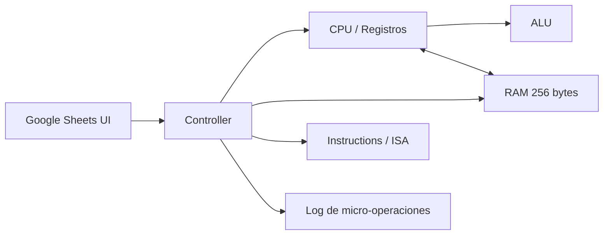

# Simulador visual de CPU de 8 bits

Proyecto de Arquitectura de Computadoras desarrollado en Google Sheets y Google Apps Script (JavaScript). Simula una CPU de 8 bits con arquitectura von Neumann, memoria principal de 256 bytes, registros, ALU, flags y ciclo completo de instrucción.

## Estado

El simulador se encuentra funcional y permite ejecutar un programa demostrativo en modo paso a paso o continuo.

## Características principales

- RAM de 256 bytes: 00h a FFh.
- Registros: PC, IR, MAR, MDR, AX y BX.
- Flags: ZF, CF y SF.
- ALU de 8 bits.
- Operaciones Read(address) y Write(address, value).
- Ciclo FETCH -> DECODE -> EXECUTE -> STORE.
- Modos STEP y RUN.
- Controles LOAD, STEP, RUN, PAUSE y RESET.
- Log cronológico de micro-operaciones.
- Interfaz visual con RAM 16x16 y resaltado de la dirección MAR.
- Programa demostrativo con bucle y salto condicional.

## Arquitectura



El detalle de la arquitectura está en [docs/arquitectura.md](docs/arquitectura.md).

## Ciclo de instrucción

### Fetch

```text
MAR <- PC
MDR <- RAM[MAR]
IR  <- MDR
PC  <- PC + 1
```

### Decode

Interpreta el opcode usando la tabla ISA y obtiene los operandos.

### Execute

Realiza la operación aritmética, lógica, de transferencia o de control.

### Store

Aplica la escritura pendiente sobre un registro o sobre RAM.

## ISA mínima

Transferencia:
- MOV
- LOAD
- STORE

Aritmética:
- ADD
- SUB
- INC
- DEC
- CMP

Control de flujo:
- JMP
- JZ
- JNZ
- HLT

La tabla formal de opcodes y formatos se encuentra en [docs/isa.md](docs/isa.md).

## Programa demostrativo

El archivo [examples/programa_demo.asm](examples/programa_demo.asm) calcula 3 x 5 mediante sumas sucesivas:

```asm
MOV AX, 0
MOV BX, 5

LOOP:
ADD AX, 3
DEC BX
CMP BX, 0
JNZ LOOP

STORE [F0h], AX
HLT
```

Resultado esperado:

```text
AX = 0Fh
BX = 00h
RAM[F0h] = 0Fh
HALTED = SI
```

## Estructura del repositorio

```text
src/
  Memory.gs
  CPU.gs
  ALU.gs
  Instructions.gs
  Controller.gs
  UI.gs
  Controls.gs

tests/
  MemoryTests.gs
  ALUTests.gs
  FetchTests.gs
  DecodeTests.gs
  ExecuteTests.gs
  StoreTests.gs
  LoadStoreTests.gs
  ControlFlowTests.gs
  InstructionTests.gs
  ProgramTests.gs

docs/
  arquitectura.md
  isa.md
  manual.md
  pruebas.md

examples/
  programa_demo.asm
```

## Documentación

- [Arquitectura](docs/arquitectura.md)
- [ISA](docs/isa.md)
- [Manual de usuario](docs/manual.md)
- [Pruebas](docs/pruebas.md)

## Uso rápido

1. Abrir la hoja vinculada al proyecto de Apps Script.
2. Ir a la pestaña Simulador.
3. Pulsar LOAD.
4. Usar STEP para observar cada fase o RUN para ejecución continua.
5. Usar PAUSE para detener temporalmente la ejecución.
6. Usar RESET para reiniciar CPU y RAM.

## Validación

Los módulos fueron probados individualmente y también mediante un programa integrado con bucle, comparación, salto condicional, almacenamiento en RAM y HLT.
