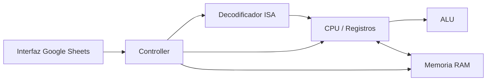

# Diseño inicial de arquitectura

## Modelo general

El simulador seguirá una arquitectura von Neumann simplificada de 8 bits. La CPU y los datos compartirán una memoria principal de 256 posiciones direccionables desde 00h hasta FFh.

## Módulos

### CPU

Mantendrá el estado de los registros visibles:

- PC: dirección de la siguiente instrucción.
- IR: instrucción actual.
- MAR: dirección de memoria que se está accediendo.
- MDR: dato transferido desde o hacia memoria.
- AX: acumulador principal.
- BX: registro de propósito general.
- ZF: resultado igual a cero.
- CF: acarreo o desbordamiento sin signo.
- SF: bit de signo del resultado.

### Memoria

La memoria tendrá 256 bytes. Cada posición almacenará un valor entre 0 y 255.

Las operaciones de acceso se centralizarán en:

```text
Read(address)
Write(address, value)
```

De esta forma la CPU no modificará directamente la representación visual de la hoja.

### ALU

La ALU realizará inicialmente:

- ADD
- SUB
- INC
- DEC
- AND
- OR
- XOR
- NOT
- CMP

Después de las operaciones correspondientes se actualizarán ZF, CF y SF.

### Unidad de control

Coordinará el ciclo de instrucción mediante cuatro fases:

```text
FETCH -> DECODE -> EXECUTE -> STORE
```

Cada pulsación de STEP avanzará una fase. RUN repetirá las fases automáticamente hasta PAUSE o HLT.

## Flujo básico de una instrucción

### Fetch

```text
MAR <- PC
MDR <- RAM[MAR]
IR  <- MDR
PC  <- PC + 1
```

### Decode

La unidad de control identificará el opcode, los operandos y el modo de direccionamiento.

### Execute

Se realizará la operación correspondiente en la ALU o en la unidad de control.

### Store

El resultado será escrito en un registro o en memoria cuando la instrucción lo requiera.

## Separación de responsabilidades

La implementación se dividirá en módulos para facilitar la ampliación del simulador:



Esta separación permitirá agregar posteriormente buses, dispositivos de entrada/salida e interrupciones sin reescribir completamente el núcleo del simulador.
